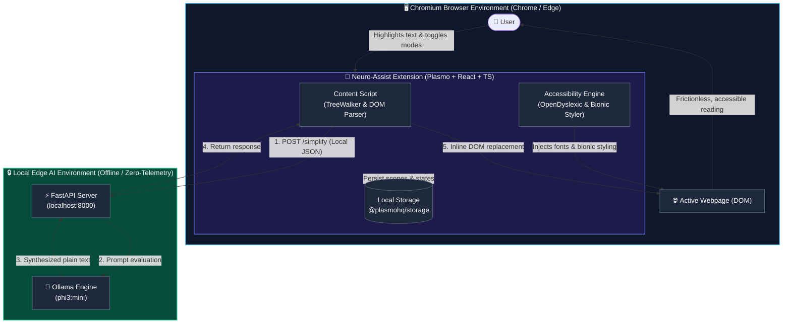

<div align="center">

# 🧠 NeuroEdge AI (Neuro-Assist)

### *A zero-telemetry, privacy-first cognitive accessibility shield powered by local Edge AI.*

[](LICENSE)
[](https://docs.plasmo.com/)
[](https://reactjs.org/)
[](https://fastapi.tiangolo.com/)
[](https://ollama.com/)
[](#-privacy-guarantee)

<p align="center">
  <a href="#-the-vision">Vision</a> •
  <a href="#-core-features">Core Features</a> •
  <a href="#-system-architecture">Architecture</a> •
  <a href="#-tech-stack">Tech Stack</a> •
  <a href="#-getting-started">Getting Started</a> •
  <a href="#-privacy-guarantee">Privacy Model</a>
</p>

</div>

---

## 🚀 The Vision

The modern web is built for engagement and stimulation, but for neurodivergent individuals—especially those with ADHD, Autism, or Dyslexia—this digital environment frequently triggers severe cognitive overload, visual fatigue, and comprehension barriers.

Traditional accessibility extensions attempt to address this by transmitting reading data to third-party cloud APIs. This introduces latency, breaks offline functionality, and fundamentally compromises user privacy.

**NeuroEdge AI solves this natively at the edge.** By combining local LLM inference engines (`phi3:mini` via Ollama) with GPU-accelerated Document Object Model (DOM) transformations, the extension restructures typographical physics, visual layouts, and linguistic complexity entirely on the user's local machine.

- **Zero Cloud Dependencies:** All processing occurs locally on your hardware.
- **Zero Telemetry:** Reading history and highlighted content never leave `localhost`.
- **True Accessibility:** Real-time visual and linguistic transformation tailored to cognitive needs.

---

## ⚡ Core Features

### 1. 🧠 Edge-AI Simplifier (Local Inference)
- Highlight dense corporate jargon, convoluted legalese, or complex academic literature.
- Content is routed locally to an isolated Python FastAPI backend running a quantized local model (`phi3:mini`).
- Synthesizes the text into clean, digestible language and performs seamless inline replacement in milliseconds without reloading the page.

### 2. 📖 Clinical OpenDyslexic Typography
- Bypasses strict Chromium Content Security Policies (CSPs) by dynamically injecting native `OpenDyslexic` font binaries into the browser runtime via the `FontFace` API.
- Restyles active web typography with bottom-weighted characters to anchor visual saccades and prevent letter inversions or word flipping.

### 3. 🎯 ADHD Hyper-Focus (Bionic Reading Matrix)
- An optimized algorithmic `TreeWalker` traverses textual DOM elements in real-time.
- Fixates reading gaze by applying high-contrast `font-weight: 900` styling to word prefixes while attenuating trailing suffixes.
- Guides the visual cortex across sentences to preserve attention and reading speed without breaking host layout constraints.

### 4. 🎛️ Dual-Scope Configuration & Cognitive Continuance
- **Scope Selector:** 
  - **Global Mode:** Automatically applies your preferred reading adaptations to every newly opened tab.
  - **Local Mode:** Applies overrides strictly to the active viewport, preserving original site styles elsewhere.
- **Cognitive Continuance:** Background listeners track scroll position and synthesized text states. If a tab closes accidentally, re-opening the URL restores the tailored reading state instantly.

---

## 🏗️ System Architecture



---

## 🛠️ Tech Stack

| Layer | Technology | Purpose |
| :--- | :--- | :--- |
| **Extension Framework** | [Plasmo](https://www.plasmo.com/) (React 18, TypeScript) | Modular MV3 extension framework with hot reload |
| **UI & Styling** | Tailwind CSS (Glassmorphism Dark Theme) | Accessible, modern control popup and overlay UI |
| **State Persistence** | `@plasmohq/storage` | Cross-tab synchronized session and scope memory |
| **Local AI Gateway** | FastAPI + Uvicorn (Python 3) | Lightweight, asynchronous local HTTP inference bridge |
| **Local LLM Runner** | [Ollama](https://ollama.com/) (`phi3:mini`) | Hardware-accelerated on-device language model inference |
| **DOM Manipulation** | Native JavaScript `TreeWalker` & `FontFace` API | Zero-dependency, performant DOM parsing and font rendering |

---

## ⚙️ Getting Started

### Prerequisites

- [Node.js](https://nodejs.org/) (v18 or higher) & `npm`
- [Python](https://www.python.org/) (v3.9 or higher)
- [Ollama](https://ollama.com/) installed and running on your system

---

### Step 1: Start the Local AI Backend

1. **Navigate to the backend directory:**
   ```bash
   cd edge-backend
   ```

2. **Create and activate a virtual environment:**
   ```bash
   # On macOS/Linux:
   python3 -m venv venv
   source venv/bin/activate

   # On Windows:
   python -m venv venv
   venv\Scripts\activate
   ```

3. **Install Python dependencies:**
   ```bash
   pip install fastapi uvicorn requests
   ```

4. **Pull the target language model via Ollama:**
   ```bash
   ollama pull phi3:mini
   ```

5. **Launch the local Edge API:**
   ```bash
   python main.py
   ```
   > The API server runs at `http://localhost:8000` with interactive docs at `http://localhost:8000/docs`.

---

### Step 2: Build the Extension

1. **Navigate to the extension directory:**
   ```bash
   cd edge-assistant
   ```

2. **Install project dependencies:**
   ```bash
   npm install
   ```

3. **Build the production bundle:**
   ```bash
   npm run build
   ```
   *For development with live reloading, run `npm run dev` instead.*

---

### Step 3: Load the Extension into Chromium

1. Open **Google Chrome**, **Microsoft Edge**, or **Brave** and navigate to `chrome://extensions/`.
2. Toggle on **Developer mode** in the top-right corner.
3. Click **Load unpacked**.
4. Select the build output directory:
   ```text
   edge-assistant/build/chrome-mv3-prod
   ```
   *(If using `npm run dev`, select `edge-assistant/build/chrome-mv3-dev`)*.

---

## 🎮 How to Use

1. **Pin the Extension:** Click the puzzle icon in your browser toolbar and pin **Neuro-Assist**.
2. **Configure Reading Modes:**
   - Click the extension icon to open the Glassmorphism Control Center.
   - Toggle **OpenDyslexic Font** to inject dyslexia-friendly typography.
   - Toggle **Bionic Focus** to activate fixation prefix highlighting.
   - Select your **Scope** (`Global` across all tabs or `Local` for the current page).
3. **Simplify Complex Text:**
   - Highlight any challenging passage or jargon-heavy paragraph.
   - Click the inline simplify trigger to receive an instant, plain-language breakdown generated locally by `phi3:mini`.

---

## 🔒 Privacy Guarantee

```
  ┌─────────────────────────────────────────────────────────────┐
  │                 ON-DEVICE PRIVACY BOUNDARY                  │
  │                                                             │
  │   Webpage Content ──► Browser Extension ──► Localhost:8000  │
  │                                                   │         │
  │                                                   ▼         │
  │   Inline Replacement ◄── Transformed Text ◄── Ollama Engine │
  │                                                             │
  │              [ NO CLOUD • NO TELEMETRY • OFFLINE ]          │
  └─────────────────────────────────────────────────────────────┘
```

- **Strict Network Containment:** All network requests are routed exclusively to `localhost:8000`. No remote analytics, tracking pixels, or external API calls exist within the codebase.
- **Local DOM Modification:** Text substitutions and font injections happen in-memory within your active browser tab.
- **Absolute Data Sovereignty:** Your reading habits, highlighted materials, and personal data never leave your physical device.

---

## 📄 License

This project is licensed under the [MIT License](LICENSE).
